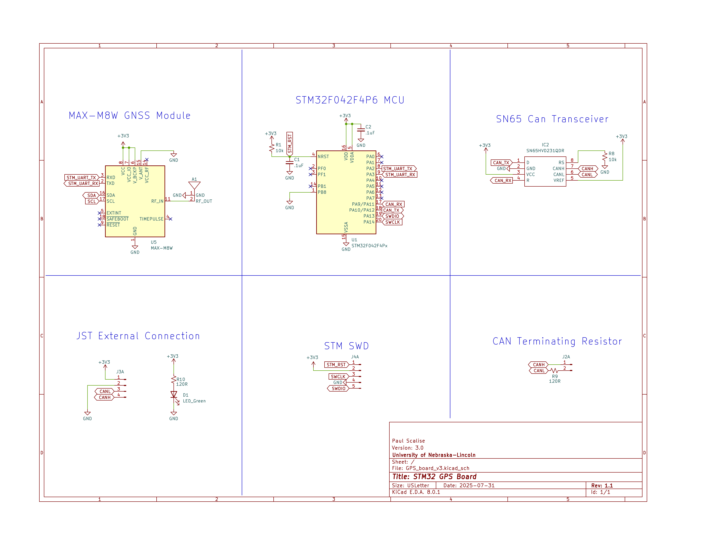
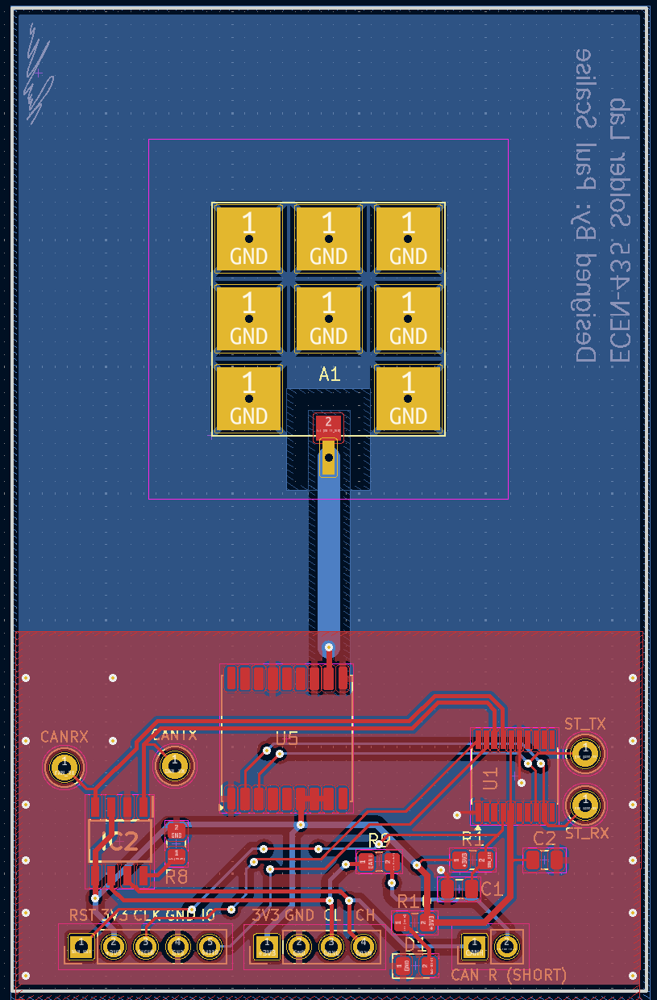

# GPS Board v3.0 r1.1

This board is designed for ECEN-435 at the University of Nebraska-Lincoln (Scott Campus).
GPS coordinates will print via CAN every 4 seconds. All GPS information sent over CAN is ASCII encoded.
To obtain a lock, you must have a direct line of sight to the sky!!
For CAN transmissions to work properly, the CAN resistor header (CAN R) must be shorted, allowing for proper termination.

Example Messages:

Message with no GPS Lock: ```LA00.00NLO000.0E```

Message with GPS Lock: ```LA41.14NLO096.0W```

## CAN Parameters

CAN is enabled by default at 100 kbps with the following parameters.

Bit Timing Parameters:
System Clock --> ```HSI48```
Prescaler (for Time Quantum) --> ```120```
Time Quanta in Bit Segment 1 --> ```2 Times```
Time Quanta in Bit Segment 2 --> ```1 Time```
ReSynchronization Jump Width --> ```1 Time```

All Basic Parameters --> ```Disabled```

Advanced Parameters:
Operating Mode --> ```Normal```

## Firmware

The entire CubeIDE project for the STM32F042F4P6 is found in the Firmware folder.

## Connections



## Board




